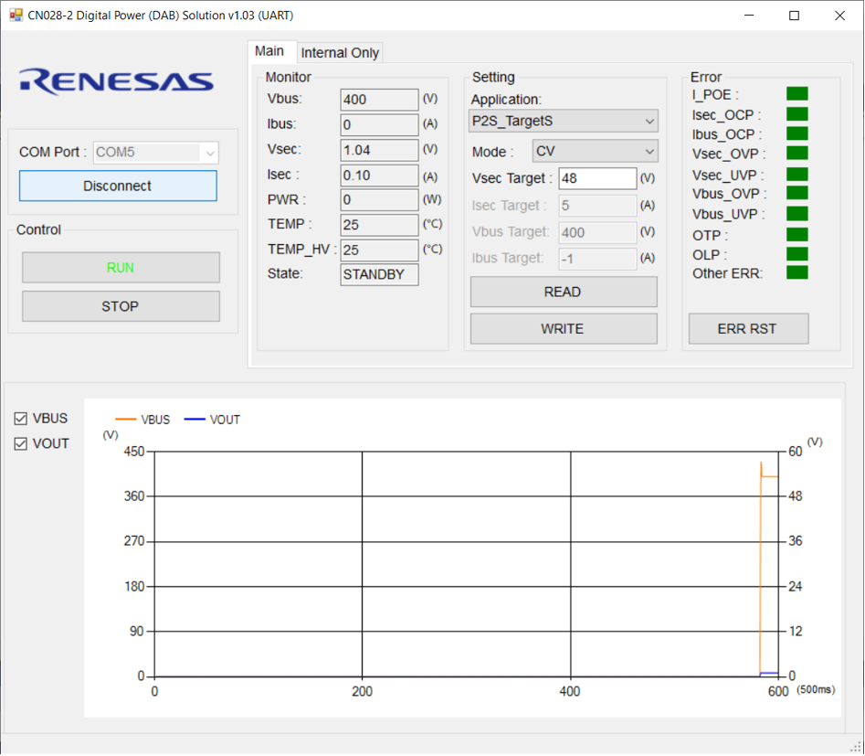
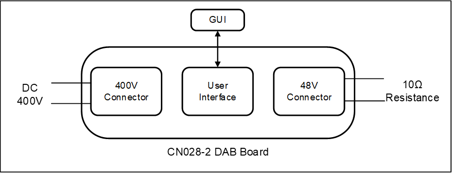
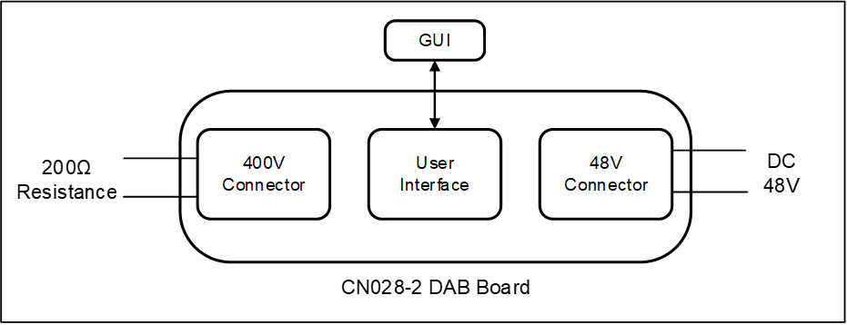
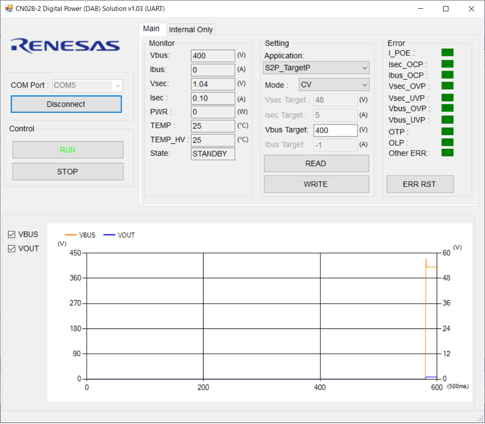
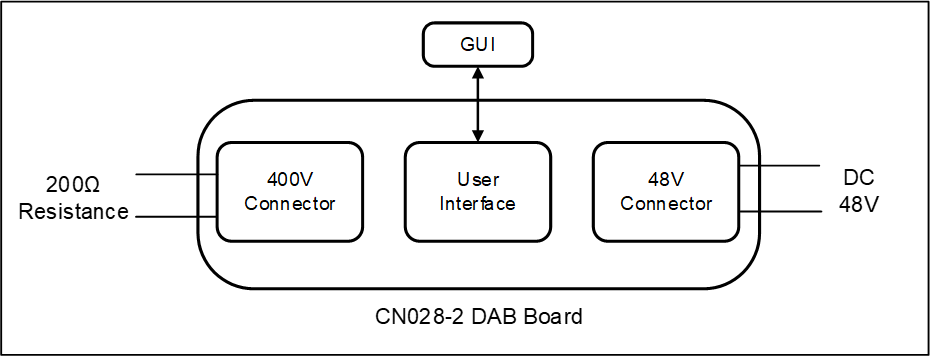
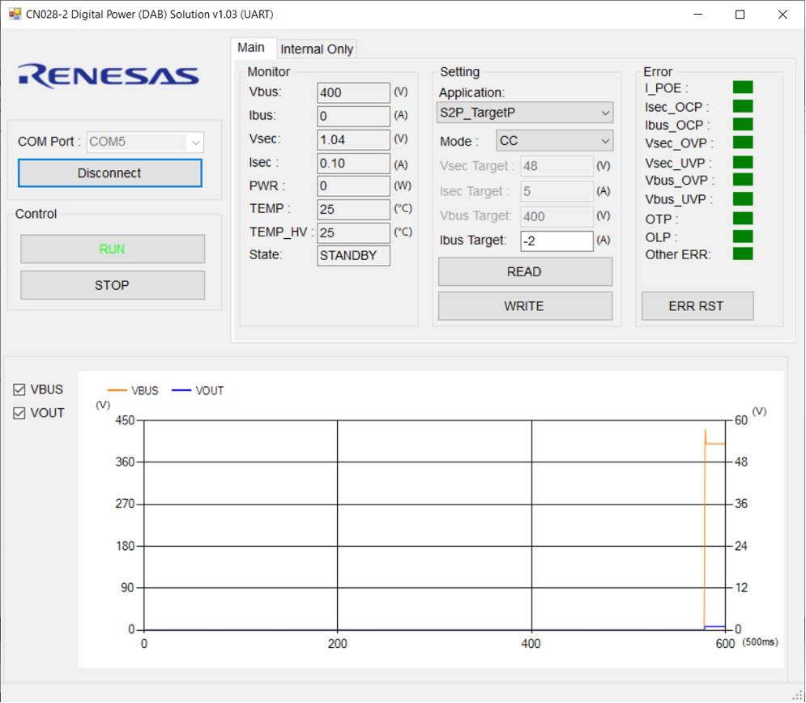

# CN028-2 Digital Power DAB

# Description
3600W bi-directional isolated DC/DC power supply based on digital control, employing a Dual Active Bridge (DAB) topology and advanced Triple Phase Shift (TPS) control algorithm, with soft switching across the entire voltage range and optimized modulation for minimum reverse power flow.

# Installation
## Operation Conditions
- Microcontroller: RA6T2 (R7FA6T2BD3CFP)
- IDE: e2-studio v2023-01 
https://www.renesas.com/us/en/document/uid/e-studio-2023-01-installer-windows
- FSP version: 4.0.0 
https://github.com/renesas/fsp/releases/tag/v4.0.0
- Toolchain: GCC 10.3.1.20210824 
https://developer.arm.com/downloads/-/gnu-rm
- Emulator: J-Link / E2 / E2-Lite

## GUI
- CN028-2 Digital Power (DAB) Solution (UART) v1.03.exe
- CN028-2 Digital Power (DAB) Solution (CAN) v1.03.exe

### USB-UART Driver
https://www.silabs.com/developers/usb-to-uart-bridge-vcp-drivers

### USB-CAN Driver
http://www.gcan.com.cn/3d05/222b/8f07/8d5f 
This driver is for the CAN-USB box (GCAN USBCAN-I Pro Bus Analyzer). 

# Usage
## Quick Start Guide
The following will take the UART version of the GUI as an example for demonstrating.

The solution supports four working modes: CV output of secondary side, CC output of secondary side, CV output of primary side, and CC output of primary side.

### CV Output of Secondary side
 
1. The above diagram shows the connection circuit. Connect J4 of MCU board to PC by micro-USB cable.
2. Power on by DC 400V on HV connector.
3. Starting “CN028-2 Digital Power (DAB) Solution (UART) vx.x.exe”, select the COM port number and click the “Connect” button.  
 
4. Set “Application” to “P2S_TargetS”. That means the power is converted from the primary side to the secondary side by controlling the output of the secondary side.
5. Set “Mode” to “CV”. And the target voltage of secondary side is set to “48” V.
6. Once the settings are changed, they need to take effect by clicking “WRITE” button.
7. Then click “RUN” button.
8. Get 48V on “LV Connector”.
9. Click “STOP” button to stop the output. And then power off.

### CC Output of Secondary side
 
1. The above diagram shows the connection circuit. Connect J4 of MCU board to PC by micro-USB cable.
2. Power on by DC 400V on HV connector.
3. Starting “CN028-2 Digital Power (DAB) Solution (UART) vx.x.exe”, select the COM port number and click the “Connect” button.  
 
4. Set “Application” to “P2S_TargetS”. That means the power is converted from the primary side to the secondary side by controlling the output of the secondary side.
5. Set “Mode” to “CC”. And the target current of the secondary side is set to “5” A.
6. Once the settings are changed, they need to take effect by clicking “WRITE” button.
7. Then click “RUN” button.
8. Get 50V on “LV Connector”.
9. Click “STOP” button to stop the output. And then power off.

Note: It is important to ensure that the appropriate current value is set based on the actual load resistance to prevent generating high voltage that can damage the board.

### CV Output of Primary side
 
1. The above diagram shows the connection circuit. Connect J4 of MCU board to PC by micro-USB cable.
2. Power on by DC 48V on LV connector.
3. Starting “CN028-2 Digital Power (DAB) Solution (UART) vx.x.exe”, select the COM port number and click the “Connect” button.  
 
4. Set “Application” to “S2P_TargetP”. That means the power is converted from the secondary side to the primary side by controlling the output of the primary side.
5. Set “Mode” to “CV”. And the target voltage of primary side is set to “400” V.
6. Once the settings are changed, they need to take effect by clicking “WRITE” button.
7. Then click “RUN” button.
8. Get 400V on “HV Connector”.
9. Click “STOP” button to stop the output. And then power off.

### CC Output of Primary side
 
1. The above diagram shows the connection circuit. Connect J4 of MCU board to PC by micro-USB cable.
2. Power on by DC 48V on LV connector.
3. Starting “CN028-2 Digital Power (DAB) Solution (UART) vx.x.exe”, select the COM port number and click the “Connect” button.  
 
4. Set “Application” to “S2P_TargetP”. That means the power is converted from the secondary side to the primary side by controlling the output of the primary side.
5. Set “Mode” to “CC”. And the target current of primary side is set to “-2” A.
(Define the direction of current from the primary side to secondary side as positive. So set the target current to a negative value if you want the current to flow from the secondary side to the primary side. )
6. Once the settings are changed, they need to take effect by clicking “WRITE” button.
7. Then click “RUN” button.
8. Get 400V on “HV Connector”.
9. Click “STOP” button to stop the output. And then power off.
